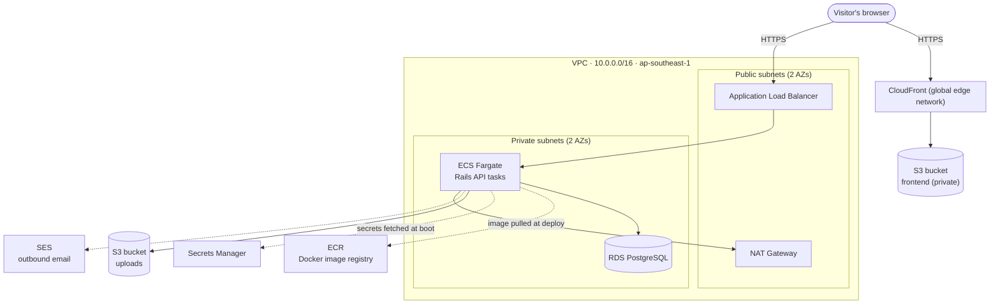
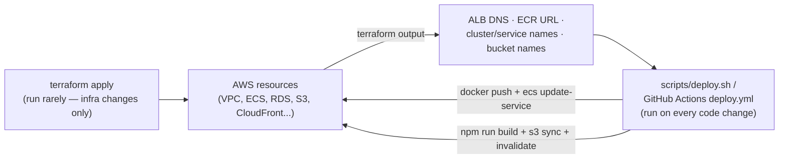

# Rally infrastructure — how Terraform works here

Prepared as background material for a presentation on Rally's Infrastructure-as-Code setup. Written for a mixed audience — some Terraform fundamentals are explained alongside the repo-specific details, so skip ahead if a section is already familiar.

## 1. What Terraform is, in plain terms

Rally's AWS infrastructure — the network, the database, the container service running the Rails API, the CDN serving the frontend, and so on — is described as code in the `infrastructure/` folder, rather than clicked together by hand in the AWS console. That's "Infrastructure as Code" (IaC), and Terraform is the tool that reads that code and makes AWS match it.

The core idea is **declarative**, not scripted: the `.tf` files describe the end state ("there should be a PostgreSQL database with these settings"), not a sequence of steps to get there. Terraform figures out the steps itself — what needs creating, what needs changing, what needs destroying — by comparing three things every time it runs:

1. **The code** — what you've written in the `.tf` files.
2. **The state** — Terraform's own record of what it created last time (for Rally, this lives remotely, not on anyone's laptop — see §4).
3. **Reality** — what actually exists in AWS right now, which Terraform checks by calling AWS's own APIs.

Why this matters for a presentation: the pitch isn't "we wrote scripts to set up AWS," it's "our infrastructure is versioned, reviewable, and reproducible the same way our application code is." A pull request that changes `infrastructure/database.tf` shows up as a diff, gets reviewed, and its exact effect can be previewed before anything actually changes.

## 2. The core Terraform workflow

Four commands cover almost everything:

| Command | What it does |
|---|---|
| `terraform init` | Downloads the AWS provider plugin, connects to the remote state backend. Run once per machine/checkout. |
| `terraform plan` | Compares code vs. state vs. real AWS, prints exactly what would change — without changing anything. This is the "preview" step. |
| `terraform apply` | Runs the plan for real: creates, updates, or destroys AWS resources to match the code. |
| `terraform output` | Prints values Terraform recorded after apply — e.g. the load balancer's URL, the database endpoint, the ECR repository name. |

A few vocabulary terms that show up constantly in the `.tf` files:

- **Provider** — a plugin that knows how to talk to a specific API. Rally uses the `aws` provider (talks to AWS) and `random` (generates passwords). See `providers.tf`.
- **Resource** — one concrete thing Terraform manages, e.g. `aws_db_instance`, `aws_ecs_service`, `aws_s3_bucket`. Each `.tf` file is just a collection of resource blocks.
- **Variable** — an input, filled in per-environment (`variables.tf` declares them; real values go in `terraform.tfvars`, which is gitignored since several are secrets).
- **Output** — a value Terraform reports back after apply, for humans or for other tooling to consume (`outputs.tf`).
- **State** — Terraform's own database of what it's created and with what IDs. Never hand-edited.

## 3. How this repo's Terraform is organized

Everything lives in one "root module" (no nested modules) — thirteen `.tf` files, each scoped to one concern:

| File | What it defines |
|---|---|
| `providers.tf` | The AWS provider, the remote state backend, and a second AWS provider aliased to `us-east-1` (see §6) |
| `variables.tf` | Every input: region, environment name, domains, database sizing, ECS sizing, and all secrets |
| `locals.tf` | Computed values derived from variables — naming prefix, CIDR blocks, feature-flag booleans for custom domains |
| `networking.tf` | VPC, public/private subnets across 2 availability zones, internet gateway, NAT gateway, route tables |
| `security_groups.tf` | Firewall rules — three groups, chained (ALB → ECS → RDS) |
| `database.tf` | The RDS PostgreSQL instance |
| `storage.tf` | S3 bucket for user file uploads (Active Storage) |
| `frontend.tf` | S3 bucket + CloudFront distribution serving the built React app, plus its ACM certificate |
| `ecr.tf` | The Docker image registry the backend gets pushed to |
| `ecs.tf` | ECS cluster, task definition, service, the Application Load Balancer, and the API's ACM certificate |
| `iam.tf` | The two IAM roles ECS tasks assume, scoped to exactly what each needs |
| `secrets.tf` | AWS Secrets Manager entries + Terraform-generated random passwords |
| `outputs.tf` | Everything printed after `apply` — URLs, resource names, a human-readable "next steps" block |

Every resource name is prefixed with `local.prefix` (`"${var.app_name}-${var.environment}"`, i.e. `rally-production-*`) — so the whole environment is identifiable at a glance in the AWS console, and a second environment (staging) could exist side by side without name collisions.

## 4. Remote state: why it's not just a file on someone's laptop

Terraform's state is stored in an S3 bucket (`providers.tf`'s `backend "s3" {}` block), not committed to git and not sitting on one engineer's machine. Two reasons that matters:

- **Team safety.** If state lived locally, two people running `terraform apply` from different laptops would have two different, disagreeing records of reality — a recipe for one of them accidentally destroying what the other just created. A shared S3 backend means everyone's `terraform plan` is comparing against the same source of truth.
- **It's sensitive.** State contains resource IDs, and in some setups, secret values in plaintext — worth protecting the same way credentials are.

One deliberate quirk worth mentioning in the talk: the S3 bucket for state has to be created *before* `terraform init` even runs (there's a chicken-and-egg problem — Terraform can't use a bucket it doesn't know about yet to store the state about creating that bucket). `providers.tf` has the exact `aws s3api create-bucket` command in a comment for this reason.

## 5. What Terraform actually provisions



Walking it top to bottom:

- **Networking** (`networking.tf`, `security_groups.tf`) — one VPC, split into public subnets (where the load balancer and NAT gateway live) and private subnets (where the actual application and database live, unreachable directly from the internet). Firewall rules are chained: the internet can reach the ALB, the ALB can reach ECS, ECS can reach RDS — nothing skips a link in that chain. One NAT gateway (not one per AZ) is a deliberate cost tradeoff, called out in a comment (~$32/month; the alternative is VPC interface endpoints).
- **Compute** (`ecs.tf`) — the Rails API runs as an ECS Fargate service (no EC2 instances to patch), behind an Application Load Balancer. The task definition wires in environment variables and secrets, a health check against Rails 8's built-in `/up` endpoint, and a **deployment circuit breaker** that automatically rolls back if new tasks keep failing to start.
- **Database** (`database.tf`) — RDS PostgreSQL, private (no public IP), encrypted storage, 7-day automated backups, deletion protection on, and a `multi_az` flag that's a variable rather than hardcoded — on (synchronous standby, automatic failover) for production, off for a cheaper staging environment.
- **Container registry** (`ecr.tf`) — where the CI pipeline pushes the built Rails Docker image. A lifecycle policy auto-deletes anything past the 10 most recent images, so storage cost doesn't grow forever.
- **Frontend hosting** (`frontend.tf`) — the built React app is static files in a private S3 bucket, served through CloudFront. The bucket has no public access at all; CloudFront reaches it through an **Origin Access Control**, and a bucket policy scoped to that specific CloudFront distribution's ARN is the only thing allowed to read it.
- **Secrets** (`secrets.tf`, `iam.tf`) — six values (database URL, JWT signing secret, Rails master key, payment gateway credentials, reCAPTCHA key) live in AWS Secrets Manager, not in the task definition or anywhere visible in the console. The ECS *execution* role (distinct from the *task* role the running app uses) is the only thing with permission to fetch them, and only at container startup.
- **Email** — no dedicated resource file; SES permissions are just an IAM policy statement on the task role (`iam.tf`), since SES itself doesn't need provisioning the way a database does.

## 6. Two AWS providers in one config — a genuine gotcha

`providers.tf` declares the `aws` provider twice — once as the default (region = `var.aws_region`, i.e. `ap-southeast-1`), and once aliased `us_east_1`. This isn't redundancy; it's a hard AWS requirement: **a CloudFront distribution's SSL certificate must be issued in `us-east-1`, no matter what region CloudFront itself (or anything else in the app) runs in.** `frontend.tf`'s ACM certificate resource explicitly passes `provider = aws.us_east_1` to satisfy that. Every other resource in the config uses the default (Southeast Asia) provider. This is a good "gotcha" moment for a presentation — it's the kind of AWS-specific rule that's invisible until you hit it.

## 7. Custom domains are optional, and it shows in the code

`api_domain`, `frontend_domain`, and `route53_zone_id` all default to empty strings. Leave them unset and Terraform issues plain AWS URLs (the ALB's own DNS name, CloudFront's own `*.cloudfront.net` domain) with no certificates to manage. Set a domain and Terraform provisions an ACM certificate and, if Route 53 is the DNS host, the validation and alias records too.

The interesting part for the talk: **the code also supports a domain hosted somewhere that *isn't* Route 53** (Cloudflare, Namecheap, etc.) — `locals.tf`'s `use_route53_for_api`/`use_route53_for_frontend` flags split this into two paths. With Route 53, Terraform does everything, end to end. Without it, Terraform still creates the certificate, then prints the exact CNAME records to paste into whatever DNS host is actually being used, via `outputs.tf`'s `api_cert_validation_record` / `frontend_cert_validation_records`. That's Terraform managing what it can, and handing off cleanly at the boundary of what it can't reach.

## 8. What Terraform does *not* do: deploying the app

This is the single most important distinction to land in the presentation, because it's the one people most often get backwards.

**Terraform provisions infrastructure. It does not deploy application code**, and it's barely involved once the infrastructure exists. Two things make this explicit in the code itself:

```hcl
# ecs.tf
resource "aws_ecs_task_definition" "app" {
  # ...
  lifecycle {
    # Image tag is managed by the deploy script, not Terraform.
    # Running `terraform apply` won't roll back a deploy.
    ignore_changes = [container_definitions]
  }
}

resource "aws_ecs_service" "app" {
  # ...
  lifecycle {
    # task_definition and desired_count are managed by the deploy script
    ignore_changes = [task_definition, desired_count]
  }
}
```

`ignore_changes` tells Terraform "don't treat a difference here as drift to fix." Every deploy — whether a push to `main` triggers `.github/workflows/deploy.yml`, or someone runs `scripts/deploy.sh` by hand — pushes a new Docker image and points the ECS service at it *directly through the AWS API*, without ever calling `terraform apply`. If Terraform didn't ignore those two fields, the next `terraform apply` would see "the real task definition doesn't match what I created" and try to revert the app back to whatever image tag was last in the `.tf` files — undoing every deploy since.



So the division of labor is: Terraform builds the stage once (and updates it when the *infrastructure* needs to change — a bigger database, a new environment variable, more CPU); `deploy.sh` / the GitHub Actions workflow perform on that stage every time the *application* changes. `scripts/deploy.sh` even reads its target names (`terraform output ecr_repository_url`, `ecs_cluster_name`, `frontend_bucket_name`, etc.) directly from Terraform's own outputs, rather than hardcoding them — the two are connected, just not on every run.

## 9. A day in the life: what actually happens

Setting up a brand-new environment, start to finish:

1. **Bootstrap the state bucket** (once, by hand — see §4): `aws s3api create-bucket ...` plus enabling versioning.
2. **`terraform init -backend-config=backend.hcl`** — downloads providers, connects to that bucket.
3. **Fill in `terraform.tfvars`** — the Rails master key, database sizing, optional custom domains, optional third-party credentials (ABA PayWay, Google OAuth, reCAPTCHA). Secrets never get typed into the `.tf` files themselves.
4. **`terraform plan`** — review exactly what's about to be created. For a first run, this is *everything*: VPC through CloudFront.
5. **`terraform apply`** — Terraform creates roughly 40+ resources in dependency order (VPC before subnets, subnets before RDS, RDS before the secret that embeds its connection string, ECR before the ECS task definition that references its image, and so on — all inferred automatically from which resources reference which).
6. **`terraform output`** — grab the ECR URL, cluster name, ALB DNS, S3 bucket names. `outputs.tf`'s `next_steps` output prints literal next commands to run.
7. **First deploy** — `./scripts/deploy.sh` builds and pushes the Docker image, updates the ECS service, waits for it to stabilize, smoke-tests `/up`, then builds and syncs the frontend.

After that initial setup, the day-to-day loop is almost entirely step 7 repeating — `terraform apply` only comes back into play when the *infrastructure itself* needs to change (resizing the database, adding a new secret, adjusting Fargate CPU/memory).

## 10. Suggested flow for the presentation

Given a mixed-experience audience, a talk built roughly in this order tends to land well:

1. Open with **why** — infrastructure as reviewable, versioned code, not console clicks nobody remembers making (§1).
2. A **60-second Terraform primer** — plan/apply, state, providers (§2), just enough vocabulary that the rest of the talk makes sense.
3. **Show the architecture diagram** (§5) and narrate it left-to-right: a request's journey from the browser to the database and back.
4. Land the **"Terraform builds the stage, deploy scripts perform on it"** distinction (§8) — this is usually the one insight people didn't already have, and it reframes everything else in the talk.
5. Close with one or two **specific, concrete details** that make it feel real rather than abstract — the `us-east-1` CloudFront certificate quirk (§6) and the external-DNS fallback (§7) both work well as "here's a real problem this solved" examples.

## Glossary

- **IaC (Infrastructure as Code)** — describing infrastructure in version-controlled files instead of manual console configuration.
- **Declarative** — the code says *what* should exist, not the steps to create it; the tool figures out the steps.
- **Provider** — a Terraform plugin for one API (AWS, in this case).
- **Resource** — one managed thing (a database, a bucket, a security group rule).
- **State** — Terraform's record of what it has created, stored remotely in S3 here.
- **Plan / Apply** — preview changes, then make them for real.
- **VPC** — an isolated virtual network in AWS; Rally's has public subnets (internet-facing) and private subnets (not directly reachable).
- **Fargate** — AWS's "serverless" container runtime; no EC2 instances to manage.
- **ALB (Application Load Balancer)** — distributes incoming HTTP(S) requests across running containers.
- **ACM** — AWS Certificate Manager; issues the TLS certificates HTTPS needs.
- **OAC (Origin Access Control)** — lets CloudFront read a private S3 bucket without the bucket being public.
- **ECR** — AWS's Docker image registry.
- **IAM role** — a set of permissions a resource (not a person) can assume; Rally uses two, scoped narrowly to what each actually needs.
